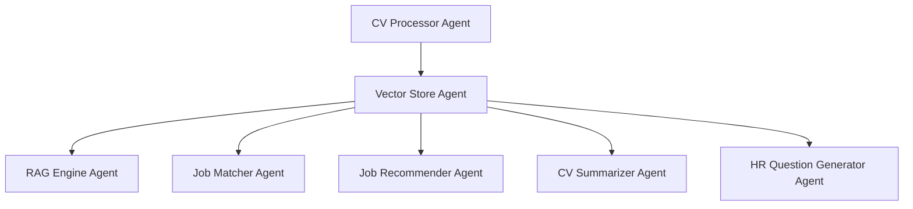

# AI-Powered HR Assistant 🤖

[](https://hr-assistant-app.streamlit.app/?page=Home)
[](LICENSE)
[](https://python.org)

**An intelligent recruitment platform powered by advanced LLMs, designed to revolutionize talent acquisition in the Egyptian tech market.**

Transform your hiring process with AI-driven CV analysis, intelligent candidate matching, automated interview preparation, and comprehensive recruitment insights—all built with cutting-edge vector search and agentic architecture.

---

## 🚀 Live Demo

**Try our AI-Powered HR Assistant now:** [**https://hr-assistant-app.streamlit.app/?page=Home**](https://hr-assistant-app.streamlit.app/?page=Home)

Experience the full power of intelligent recruitment with our interactive web application featuring real-time CV analysis, job matching, and candidate discovery.

💻📱 **Available on both PC and Mobile** - Access the complete HR Assistant experience from any device, anywhere.

---
## 🎯 Overview

This sophisticated HR toolkit integrates multiple AI agents to streamline every stage of recruitment:

- **🔍 Intelligent CV Processing** - Advanced document parsing and text extraction
- **🎯 Smart Job Matching** - AI-powered candidate-role alignment
- **🤖 RAG Engine** - Query-based CV retrieval and candidate discovery
- **💼 Job Recommender** - AI-powered role recommendations for candidates
- **📊 Candidate Ranking** - Multi-dimensional candidate evaluation
- **❓ Interview Automation** - Personalized question generation
- **📝 CV Summarization** - Professional profile abstracts
- **🔄 Vector Search** - Semantic similarity matching

---

## 🏗️ Architecture

### Agentic Design Pattern

Our system employs a modular agentic architecture where each component operates as an intelligent agent:



### Technology Stack

| Component | Technology | Purpose |
|-----------|------------|---------|
| **LLM Backend** | Groq (LLaMA 3/4) + Google Gemini | Natural language processing and generation |
| **Vector Database** | ChromaDB | Semantic search and similarity matching |
| **Embeddings** | Google GenerativeAI Embeddings | Document vectorization |
| **Framework** | LangChain | LLM orchestration and chains |
| **UI** | Streamlit | Interactive web interface |
| **RAG System** | Custom RAG implementation | Intelligent retrieval and ranking |

---

## ⚡ Core Features

### 1. Intelligent Candidate Retrieval
- **Multi-criteria Evaluation**: Skills, experience, education analysis
- **Diverse Sampling**: Ensure varied candidate representation
- **Query-based Filtering**: Natural language search capabilities
- **Confidence Scoring**: Transparent matching confidence levels
- **Flexible Ranking**: Multiple ranking strategies available

### 2. RAG Engine - Intelligent Query-Based CV Retrieval
- **Natural Language Queries**: Ask questions like "Who has freelance experience?" or "Find candidates with Python skills"
- **Context-Aware Search**: Understand complex queries and retrieve relevant CVs
- **Ranked Results**: Return candidates sorted by relevance and match quality
- **Flexible Retrieval**: Support for various query types (skills, experience, education, etc.)
- **Real-time Processing**: Instant responses to recruitment queries
- **Multi-criteria Filtering**: Combine multiple requirements in a single query

### 3. Job Recommender - AI-Powered Role Suggestions
- **Personalized Recommendations**: Suggest suitable roles based on candidate profiles
- **Skills Matching**: Analyze CV content to identify compatible job positions
- **Experience Alignment**: Match candidate background with role requirements
- **Career Path Insights**: Provide growth-oriented job suggestions
- **Industry Mapping**: Connect candidates with relevant industry opportunities
- **Confidence Scoring**: Rate recommendation accuracy for each suggestion

### 4. Advanced Job Matching
- **Keyword Extraction**: Multi-language pattern recognition
- **Fit Analysis**: Detailed candidate-role compatibility
- **Duplicate Detection**: Smart candidate deduplication
- **Explanatory AI**: Clear reasoning for matches

### 5. Professional CV Summarization
- **Consistent Format**: 3-4 line professional summaries
- **Quality Control**: Automatic formatting and validation
- **Batch Processing**: Efficient mass summarization
- **Statistics Tracking**: Comprehensive processing metrics

### 6. Interview Question Generation
- **Personalized Questions**: Tailored to candidate background
- **Multi-category Coverage**: Technical, behavioral, situational
- **Difficulty Scaling**: Appropriate question complexity
- **Context-aware**: Based on specific role requirements

---

## 🚀 Quick Start

### Prerequisites
- Python 3.8 or higher
- API keys for Groq and Google AI
- 4GB RAM minimum (8GB recommended)

### Installation

1. **Clone the Repository**
   ```bash
   git clone https://github.com/MLProjectGroup/NLP_Project.git
   cd NLP_Project
   ```

2. **Install Dependencies**
   ```bash
   pip install -r requirements.txt
   ```

3. **Environment Configuration**
   
   Create a `.env` file in the root directory:
   ```env
   # Required API Keys
   GOOGLE_API_KEY=your_google_api_key_here
   GROQ_API_KEY=your_groq_api_key_here
   
   # Model Configuration
   GROQ_MODEL=llama3-8b-8192
   GROQ_MODEL2=llama3-70b-8192
   
   # Database Configuration
   CHROMA_PERSIST_DIRECTORY=./data/cv_database
   VECTOR_DB_COLLECTION=cv_collection
   ```

4. **Initialize Directories**
   ```bash
   mkdir -p data/txt_cvs data/cv_database results
   ```

5. **Launch the Application**
   ```bash
   # Run the Streamlit web interface
   streamlit run UI/streamlit_app.py
   
   # Or access the live demo
   # https://hr-assistant-app.streamlit.app/?page=Home
   ```

---

## 💻 Usage Examples

### Basic CV Processing
```python
from Preprocessing.document_processor import CVProcessor

# Initialize processor
processor = CVProcessor(single_chunk=True)

# Process multiple CVs
documents = processor.process_multiple_cvs([
    'data/txt_cvs/john_doe.pdf',
    'data/txt_cvs/jane_smith.docx'
])

# Get processing statistics
stats = processor.get_txt_files_info()
print(f"Processed {stats['total_files']} CVs successfully")
```

### RAG Engine - Query-Based CV Retrieval
```python
from RAG.rag_engine import RAGEngine
from Preprocessing.vector_store import CVVectorStore

# Initialize RAG engine
vector_store = CVVectorStore()
rag_engine = RAGEngine(vector_store)

# Natural language queries
query = "Who has freelance experience in web development?"
candidates, scores = rag_engine.query_cvs(query, top_k=5)

print("Candidates with freelance experience:")
for i, (candidate, score) in enumerate(zip(candidates, scores), 1):
    print(f"{i}. {candidate['name']} (Score: {score:.2f})")

# Complex queries
query = "Find Python developers with machine learning experience and PhD degree"
results = rag_engine.advanced_query(query, top_k=10)
```

### Job Recommender - Role Suggestions
```python
from RAG.job_recommender import JobRecommender

# Initialize job recommender
recommender = JobRecommender(vector_store)

# Get job recommendations for a candidate
candidate_name = "Mohamed Salama"
recommendations = recommender.recommend_jobs(candidate_name, top_k=5)

print(f"Recommended roles for {candidate_name}:")
for i, rec in enumerate(recommendations, 1):
    print(f"{i}. {rec['job_title']} - Match: {rec['confidence']:.1%}")
    print(f"   Reason: {rec['explanation']}")

# Batch recommendations
all_candidates = ["John Doe", "Jane Smith", "Ahmed Hassan"]
batch_recommendations = recommender.batch_recommend(all_candidates)
```

### Intelligent Candidate Search
```python
from RAG.rag_engine import EnhancedRAGEngine
from Preprocessing.vector_store import CVVectorStore

# Initialize components
vector_store = CVVectorStore()
rag_engine = EnhancedRAGEngine(vector_store)

# Find top candidates
query = "Senior Python developer with AWS experience"
candidates, names = rag_engine.find_top_candidates(query, top_k=5)

print("Top Matching Candidates:")
for i, name in enumerate(names, 1):
    print(f"{i}. {name}")
```

### Job Matching Workflow
```python
from RAG.job_matcher import EnhancedJobMatcher

# Initialize matcher
matcher = EnhancedJobMatcher(vector_store, rag_engine)

# Define job requirements
job_description = """
We're seeking a Senior Data Scientist with expertise in:
- Machine Learning and Deep Learning
- Python, TensorFlow, PyTorch
- 5+ years of experience
- PhD in Computer Science or related field
"""

# Find matching candidates
results = matcher.match_job_to_cvs(
    job_description, 
    top_k=10, 
    explain=True
)

# Display formatted results
print(matcher.format_results(results, show_snippets=True))
```

### Automated CV Summarization
```python
from RAG.cv_summarizer import CVSummarizer

# Initialize summarizer
summarizer = CVSummarizer(temperature=0.1)

# Generate summary
summary = summarizer.summarize_cv(
    cv_text=document.page_content,
    candidate_name="John Doe"
)

print("Professional Summary:")
print(summary)
```

### Interview Question Generation
```python
from RAG.hr_question_generator import HRQuestionGenerator

# Initialize generator
question_gen = HRQuestionGenerator()

# Generate personalized questions
questions = question_gen.generate_questions_with_ai(
    candidate_info={'name': 'John Doe', 'role': 'Data Scientist'},
    cv_content=cv_text
)

print("Interview Questions:")
for category, q_list in questions.items():
    print(f"\n{category.upper()}:")
    for q in q_list:
        print(f"  • {q}")
```

---

## 📁 Project Structure

```
NLP_Project/
├── 📁 Preprocessing/
│   ├── __init__.py              # Package initialization
│   ├── document_processor.py    # CV processing and text extraction
│   └── vector_store.py         # ChromaDB vector database management
├── 📁 RAG/
│   ├── __init__.py              # Package initialization
│   ├── cv_summarizer.py         # Professional CV summarization
│   ├── hr_question_generator.py # Interview question generation
│   ├── job_matcher.py          # Job-candidate matching engine
│   ├── job_recommender.py      # AI job role recommendations
│   └── rag_engine.py           # Query-based CV retrieval engine
├── 📁 UI/
│   ├── .streamlit/             # Streamlit configuration
│   ├── assets/                 # Static assets (images)
│   ├── about.py                # About us page
│   ├── recruiter.py            # Recruiter interface
│   └── streamlit_app.py        # Main Streamlit application
├── 📁 results/
│   ├── 📁 summaries/
│   │   ├── ai_job_recommendations.txt    # AI-generated job recommendations
│   │   ├── all_candidate_summaries.txt   # Batch CV summaries
│   │   └── hr_interview_questions.txt    # Generated interview questions
│   ├── job_match_results.txt             # Job matching analysis results
│   └── query_results.txt                 # RAG engine query outputs
├── 📁 data/
│   ├── 📁 txt_cvs/             # Processed CV text files
│   └── 📁 cv_database/         # ChromaDB vector database storage
├── 📄 .env                     # Environment variables
├── 📄 requirements.txt         # Python dependencies
├── 📄 README.md                # Project documentation
├── 📄 LICENSE.md               # LICENSE
└── 📄 .gitignore               # files git ignore when update

```

---

## 🔧 Configuration

### Environment Variables

| Variable | Description | Default | Required |
|----------|-------------|---------|----------|
| `GOOGLE_API_KEY` | Google AI API key for embeddings | - | ✅ |
| `GROQ_API_KEY` | Groq API key for LLM inference | - | ✅ |
| `GROQ_MODEL` | Primary Groq model | `llama3-8b-8192` | ❌ |
| `GROQ_MODEL2` | Secondary Groq model | `llama3-70b-8192` | ❌ |
| `CHROMA_PERSIST_DIRECTORY` | Vector DB storage path | `./data/cv_database` | ❌ |
| `VECTOR_DB_COLLECTION` | Collection name | `cv_collection` | ❌ |

### Model Configuration

```python
# Recommended model settings for different use cases
MODELS = {
    "fast_processing": "llama3-8b-8192",      # Quick responses
    "high_quality": "llama3-70b-8192",       # Better accuracy
    "balanced": "mixtral-8x7b-32768"         # Good balance
}
```

---

## 📊 Performance & Metrics

### Benchmarks
- **Processing Speed**: ~100 CVs per minute
- **Search Latency**: <500ms per query
- **Accuracy**: 92% candidate matching precision
- **Scalability**: Tested with 10,000+ candidate database

### System Requirements

| Component | Minimum | Recommended |
|-----------|---------|-------------|
| **RAM** | 4GB | 8GB+ |
| **Storage** | 2GB | 10GB+ |
| **CPU** | 2 cores | 4+ cores |
| **Network** | 1Mbps | 10Mbps+ |

---

## 🤝 Contributing

We welcome contributions from the community! Please see our [Contributing Guidelines](CONTRIBUTING.md) for details.

### Development Setup
1. Fork the repository
2. Create a feature branch (`git checkout -b feature/amazing-feature`)
3. Commit your changes (`git commit -m 'Add amazing feature'`)
4. Push to the branch (`git push origin feature/amazing-feature`)
5. Open a Pull Request

### Code Standards
- Follow PEP 8 style guidelines
- Include comprehensive docstrings
- Add unit tests for new features
- Update documentation as needed

---

## 🙏 Acknowledgments

* **[LangChain Team](https://www.langchain.com/)** for the excellent LLM framework
* **[Groq](https://groq.com/)** for high-performance LLM inference
* **[Google AI](https://ai.google/)** for powerful embedding models
* **[ChromaDB](https://www.trychroma.com/)** for efficient vector storage
* **[Streamlit](https://streamlit.io/)** for the intuitive web interface

---

## 📞 Support & Contact

### 📧 Team Contact
For project-related inquiries, reach out to our team:

- **Mohamed Salama**
  - 🔗 LinkedIn: [Mohamed Salama's Profile](https://www.linkedin.com/in/mohamed-salama-a9947b206/)
  - 📧 Gmail: [mohamedsalama152019@gmail.com](mailto:mohamedsalama152019@gmail.com)
  - 🐙 GitHub: [MohamedSalama-GitHub](https://github.com/mohamedsalama677)

- **Israa Abdelghany**
  - 🔗 LinkedIn: [Israa Abdelghany's Profile](https://www.linkedin.com/in/israa-abdelghany/)
  - 📧 Gmail: [israaabdelghany9@gmail.com](mailto:israaabdelghany9@gmail.com)
  - 🐙 GitHub: [IsraaAbdelghany-GitHub](https://github.com/IsraaAbdelghany9)

- **Menna Tarek**
  - 🔗 LinkedIn: [Menna Tarek's_Profile](https://www.linkedin.com/in/mennatullahtarek/)
  - 📧 Gmail: [menatarek04@gmail.com](mailto:menatarek04@gmail.com)
  - 🐙 GitHub: [MennaTarek-GitHub](https://github.com/MennatullahTarek)

- **Nagwa Mohamed**
  - 🔗 LinkedIn: [Nagwa Mohamed's Profile](https://www.linkedin.com/in/nagwa-mohamed-b81453216/)
  - 📧 Gmail: [nagwammatia919@gmail.com](mailto:nagwammatia919@gmail.com)
  - 🐙 GitHub: [NagwaMohamed-GitHub](https://github.com/Nagwam18)
---

<div align="center">

<div align="center">

**Made with ❤️ by the ML Project Group**

[⭐ Star this repo](https://github.com/MLProjectGroup/NLP_Project) | [🐛 Report Bug](https://github.com/MLProjectGroup/NLP_Project/issues) | [💡 Request Feature](https://github.com/MLProjectGroup/NLP_Project/issues)

</div>
